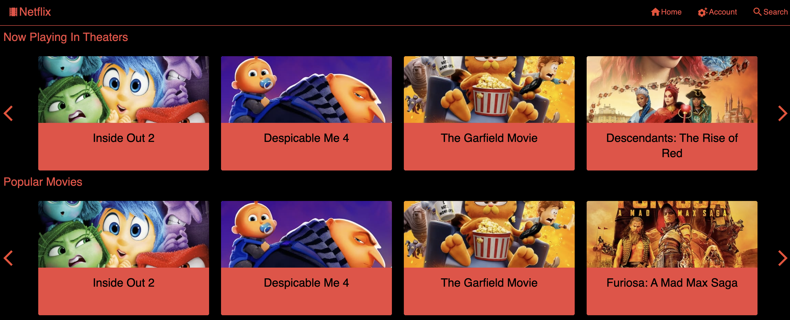
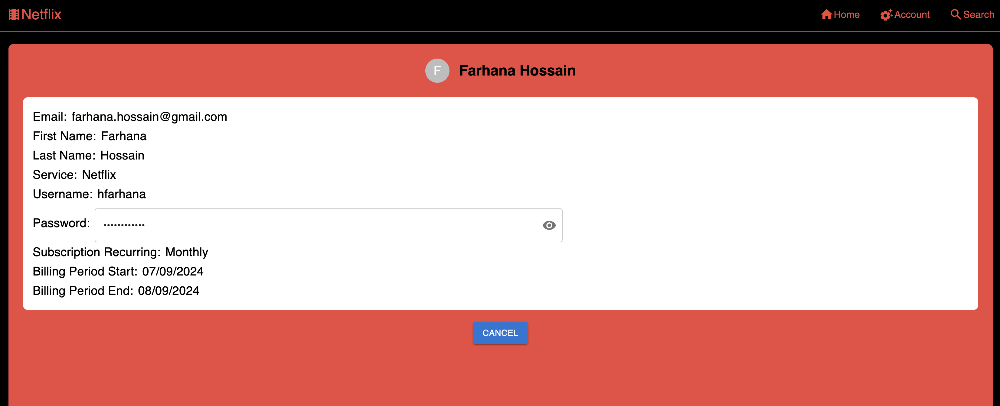
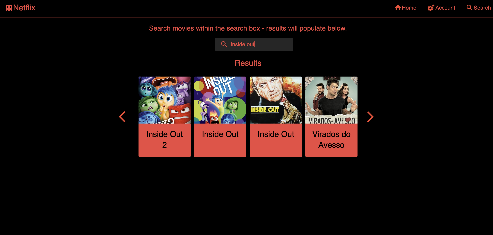
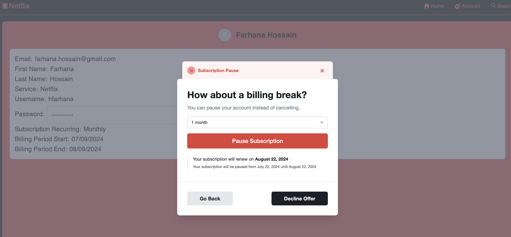
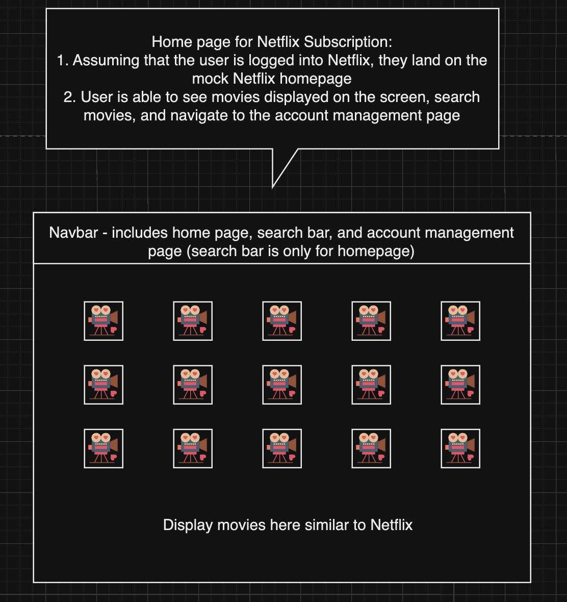
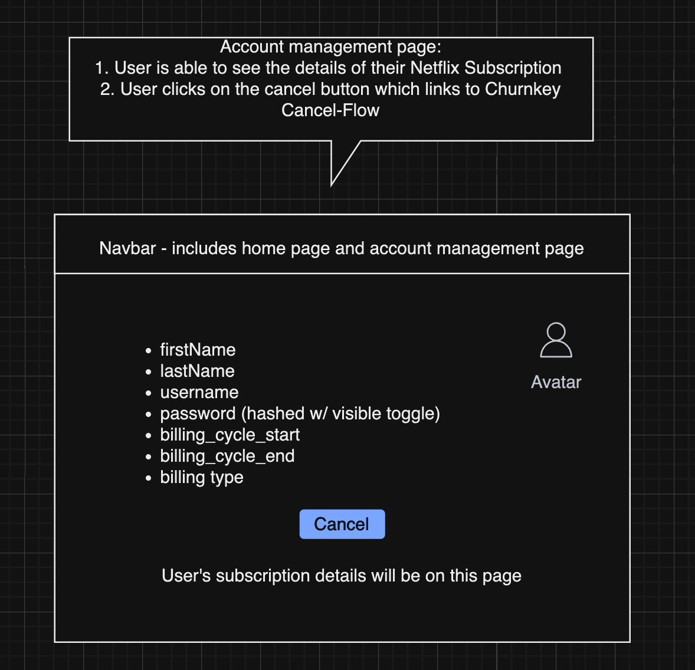

# Netflix Mock-up

## Introduction

Welcome to the Netflix Mock-up app! This app allows users to browse through various categories of movies from [The Movie Database (TMDB) API](https://developer.themoviedb.org/reference/intro/getting-started). Here’s what you can do:

- **Home Page ("/")**: View movies in four categories: "Now Playing", "Popular", "Top Rated", and "Upcoming". Hover over a movie to see its summary. Click the arrows to scroll between all the movies for each category.
- **Navigation Bar**: Navigate to the home page, account management settings, and the search page. The search page allows users to input a query and see the search results.
- **Account Management Page**: View account details and cancel your subscription via the Churnkey cancel flow.

## Running the Code Locally

To run the project locally, follow these steps:

1. Install all dependencies: `npm i`

2. Create a .env file at the project root and add in the variables.

3. Start the development server: `npm run dev`

The app will run at locally at _http://localhost:3000/_

## App Images

### Home Page

### Account Management (Settings)

### Search Page

### Cancel Flow

## Video

Check out the video demo of the project!

GIF created with [LiceCap](http://www.cockos.com/licecap/).

## Wireframe (Initial Design)

### Home Page

- Displays movies from various categories.

### Account Management

- Displays account details and option to cancel subscription.

## Onboarding Changes

- [x] TypeScript Syntax and Types: Adding documentation with proper TypeScript syntax and types in the QuickStart tutorial will simplify the implementation of logic. A great enhancement feature could be to create sample logic in different languages to support various programming languages/needs.

- [x] Pertaining to Step 1 (Script Placement) within Quickstart Guide: Provide guidance on placing the script element in various frameworks, instead of placing it in <head>. For example, in the T3 stack, the custom script was placed in \_app.tsx where the Script tag for Next.js does not go in the head.

- [x] Pertaining to Step 2 (Generate Secure HMAC Hash) within Quickstart Guide: Show the data shape for req.body (or provide sample in guide of req.body) before destructuring customerId. It's useful to understand the structure even when the customerId is hardcoded.

- [x] Pertaining to Step 3 (Launch Churnkey) within Quickstart Guide: Split the code into server-side and client-side logic using either two separate code blocks or adding in a comment specifying this to avoid beginners adding everything in one file. Additionally, include proper typing for window.churnkey.init - I was able to resolve the typing issue by declaring a global type.

- [x] Testing the Cancel Flow: It would be helpful to see a real-time customer cancellation pop-up in the Churnkey test account instead of having a pre-existing customer account. This is a nice-to-have feature for understanding the process better.

## Additional Notes

- Scrolling Through Movies: For this project, only the first page of the API results is rendered.
- Images/videos should not be stored locally in the repo (for project purposes, I added them locally).
- I hope you have as much fun going through this app as I had creating it! Thank you!
